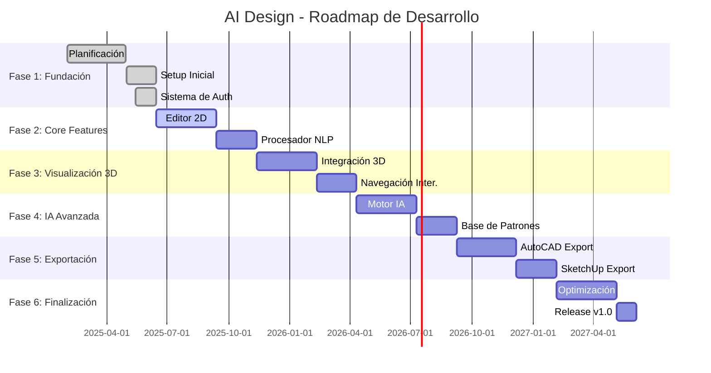

# 🎨 AI Design - Generador de Planos 2D/3D con Inteligencia Artificial

<div align="center">


[](https://nodejs.org/)
[](https://reactjs.org/)
[](https://www.typescriptlang.org/)
[](https://threejs.org/)

*Crea planos arquitectónicos 2D/3D usando lenguaje natural e inteligencia artificial*

[⚡ Instalación](#-instalación-rápida) • [🛠️ Roadmap](#️-roadmap-técnico-detallado)

**⚠️ Proyecto en Desarrollo Activo - Duración estimada: 18 meses**

</div>

---

## 🎯 Visión del Proyecto

**AI Design** es una plataforma revolucionaria que democratiza la creación de planos arquitectónicos mediante **inteligencia artificial** y **procesamiento de lenguaje natural**. 

### 🌟 **¿Qué hace AI Design?**

Permite a **cualquier persona**, sin conocimientos técnicos de CAD, crear planos profesionales simplemente describiendo lo que necesita en **lenguaje natural**.

```
👤 Usuario: "Necesito una casa de 120m² con 3 habitaciones, 2 baños, 
             cocina abierta al salón y un garaje para 2 coches"

🤖 AI Design: [Genera plano 2D/3D completo + archivos descargables]
```

---

## 🚀 Funcionalidades Principales

### 🗣️ **Interfaz de Lenguaje Natural**
- 🔄 **En desarrollo** - Procesamiento de texto inteligente
- 🔄 **En desarrollo** - Comprensión contextual de requerimientos arquitectónicos
- 🔄 **En desarrollo** - Interpretación de medidas y espacios
- 🔄 **En desarrollo** - Sugerencias automáticas basadas en estándares

### 🏠 **Generación de Planos Inteligente**
- 🔄 **En desarrollo** - Planos 2D técnicos y detallados
- 🔄 **En desarrollo** - Visualización 3D interactiva con Three.js
- 🔄 **En desarrollo** - Distribución optimizada de espacios
- 🔄 **En desarrollo** - Cumplimiento de normativas arquitectónicas básicas

### 📁 **Exportación Multiformato**
- 🔄 **En desarrollo** - AutoCAD (.dwg, .dxf) - Compatibilidad total
- 🔄 **En desarrollo** - SketchUp (.skp) - Para modelado 3D
- 🔄 **En desarrollo** - PDF técnico - Para presentaciones
- 🔄 **En desarrollo** - PNG/JPG - Para visualización rápida
- 🔄 **En desarrollo** - Formatos 3D (.obj, .fbx, .gltf)

### 🤖 **Inteligencia Artificial Avanzada**
- 🔄 **En desarrollo** - Motor de IA personalizado
- 🔄 **En desarrollo** - Aprendizaje de preferencias del usuario
- 🔄 **En desarrollo** - Optimización automática de diseños
- 🔄 **En desarrollo** - Integración con APIs de IA especializadas

---

## 🎨 Tecnologías del Stack

### 🎯 **Frontend (En Desarrollo)**
- **React 18** + **TypeScript** - Interfaz moderna y tipo-segura
- **Three.js** - Renderizado 3D en tiempo real
- **Canvas API** - Manipulación de planos 2D
- **Material-UI** - Componentes de interfaz profesionales

### ⚙️ **Backend (En Desarrollo)**
- **Node.js** + **Express** - API REST robusta
- **TypeScript** - Desarrollo tipo-seguro
- **MySQL** - Base de datos principal
- **Sistema de Autenticación** - Gestión de usuarios completa

### 🤖 **IA y Procesamiento (Planeado)**
- **OpenAI GPT-4** - Procesamiento de lenguaje natural
- **TensorFlow/PyTorch** - Modelos de ML personalizados
- **Python APIs** - Servicios de procesamiento especializado
- **Vector Databases** - Almacenamiento de patrones arquitectónicos

### 🏗️ **Arquitectura y Exportación (Planeado)**
- **Open3D** - Procesamiento de geometría 3D
- **CAD Libraries** - Generación de archivos técnicos
- **Cloud Processing** - Renderizado pesado en la nube
- **CDN** - Distribución de assets 3D optimizada

---

## 🎯 Objetivos

### 🌟 **Misión**
> "Democratizar el diseño arquitectónico, haciendo que cualquier persona pueda crear planos profesionales sin necesidad de mucho tiempo de formación en CAD."

### 🎨 **Objetivo principal**
> "Ser el puente entre la imaginación y la realización arquitectónica, complementando (no compitiendo con) las herramientas profesionales existentes."

### 🤝 **Metas**
- **Accesibilidad primero** - Interfaz intuitiva para usuarios no técnicos
- **Complemento, no competencia** - Integramos con AutoCAD y SketchUp
- **IA al servicio del usuario** - Tecnología invisible, resultados visibles
- **Código abierto** - Desarrollo transparente y colaborativo

---

## ⚡ Instalación Rápida

### 📋 **Prerrequisitos**
- [Node.js](https://nodejs.org/) v16+ 
- [MySQL](https://www.mysql.com/) v8+
- [Git](https://git-scm.com/)

### 🚀 **Setup de Desarrollo**

```bash
# 1️⃣ Clonar el repositorio
git clone https://github.com/Leo64xl/AI-Design.git
cd AI-Design

# 2️⃣ Instalar dependencias del backend
cd backend
npm install

# 3️⃣ Instalar dependencias del frontend
cd ../frontend
npm install

# 4️⃣ Configurar variables de entorno
cd ../backend
cp .env.example .env
# Editar .env con tus configuraciones

# 5️⃣ Iniciar base de datos
# Crear BD en MySQL: ai_design_db

# 6️⃣ Ejecutar en modo desarrollo
npm run dev:backend    # Terminal 1: Backend :5000
npm run dev:frontend   # Terminal 2: Frontend :3000
```

**🌐 Accede a:** `http://localhost:3000`

---

## 🛠️ Roadmap Técnico Detallado

### 📅 **Cronología de Desarrollo**

El proyecto **AI Design** comenzó su **planificación formal en febrero de 2025**, tomándose el tiempo necesario para definir arquitectura, herramientas, requerimientos y establecer las bases sólidas del proyecto.



#### ✅ **COMPLETADO - Fase 1: Fundación (Feb - Jun 2025)**

**🔍 Planificación Estratégica (Feb - Abr 2025)**
- [x] 📊 **Análisis de requerimientos** y definición de scope
- [x] 🏗️ **Diseño de arquitectura** del sistema completo
- [x] 🛠️ **Selección de tecnologías** y stack tecnológico
- [x] 📝 **Documentación técnica** inicial y roadmap
- [x] 🎯 **Definición de objetivos** y metas del proyecto

**⚙️ Configuración Inicial (May - Jun 2025)**
- [x] 🏗️ **Setup del proyecto** con estructura modular
- [x] 📦 **Configuración de herramientas** de desarrollo
- [x] 🗄️ **Configuración de base de datos** MySQL
- [x] 🔧 **Setup de entorno** de desarrollo (Backend + Frontend)
- [x] 📋 **Configuración de TypeScript** en ambos lados

**🔐 Sistema de Autenticación Completo (May - Jun 2025)**
- [x] 👤 **Registro de usuarios** con validación completa
- [x] 🔑 **Sistema de login** con JWT y sessions
- [x] 📧 **Verificación por email** con templates HTML
- [x] 🔄 **Recuperación de contraseña** con enlaces seguros
- [x] 🛡️ **Middlewares de seguridad** y rate limiting
- [x] 📱 **Interfaz responsive** para todas las funciones

#### 🔄 **EN DESARROLLO - Fase 2: Core Features**

**🎨 Editor de Planos 2D (En progreso)**
- [ ] 📐 **Canvas interactivo** para dibujo de planos
- [ ] 🏠 **Componentes arquitectónicos** básicos (paredes, puertas, ventanas)
- [ ] 📏 **Sistema de medidas** y dimensiones
- [ ] 💾 **Guardado y carga** de proyectos

**🗣️ Procesador de Lenguaje Natural (Planeado)**
- [ ] 🤖 **Integración con APIs de IA** para procesamiento de texto
- [ ] 🧠 **Interpretación de requerimientos** arquitectónicos
- [ ] 📋 **Sistema de templates** y patrones comunes
- [ ] ✨ **Generación automática** de planos básicos

### 🎯 **Hitos Proyectados**

| Fase | Hito Principal | Funcionalidad Clave |
|------|----------------|---------------------|
| **Actual** | 🔐 **Auth System** | Sistema de usuarios completo |
| **Próximo** | 📐 **Editor Alpha** | Creación básica de planos 2D |
| **Futuro** | 🗣️ **NLP Beta** | Interpretación de texto simple |
| **Avanzado** | 🌟 **3D Viewer** | Visualización 3D interactiva |
| **Pro** | 🤖 **IA Core** | Generación inteligente completa |
| **Export** | 📁 **CAD Export** | Exportación profesional |
| **Final** | 🚀 **v1.0 Launch** | Versión completa funcional |

### 📊 **Estado Actual del Desarrollo**

**🏗️ Arquitectura Establecida:**
- ✅ **Backend**: Node.js + Express + TypeScript + MySQL
- ✅ **Frontend**: React + TypeScript + React Router
- ✅ **Autenticación**: JWT + Sessions + Email verification
- ✅ **Seguridad**: Rate limiting + Input validation + CORS

**📈 Métricas del Proyecto:**
- **Tiempo invertido**: ~4 meses de planificación y desarrollo inicial
- **Líneas de código**: +5,000 líneas (Backend + Frontend)
- **Componentes React**: 15+ componentes modulares
- **APIs implementadas**: 8 endpoints principales
- **Tests**: Sistema de testing configurado

### 🔮 **Próximos Pasos Inmediatos**

1. **🎨 Editor 2D**: Implementar canvas interactivo con herramientas básicas
2. **📐 Geometría**: Sistema de coordenadas y medidas precisas  
3. **🏠 Componentes**: Librería de elementos arquitectónicos
4. **💾 Persistencia**: Guardado de proyectos en base de datos
5. **🔄 Iteración**: Testing con usuarios y refinamiento de UX

---

<div align="center">

### 📈 **Estado del Proyecto**

<div align="center">


**📅 Inicio del proyecto:** febrero 2025  
**⏱️ Duración estimada:** 18 meses   

---

**[⬆ Volver al inicio](#-ai-design---generador-de-planos-2d3d-con-inteligencia-artificial)**

</div>